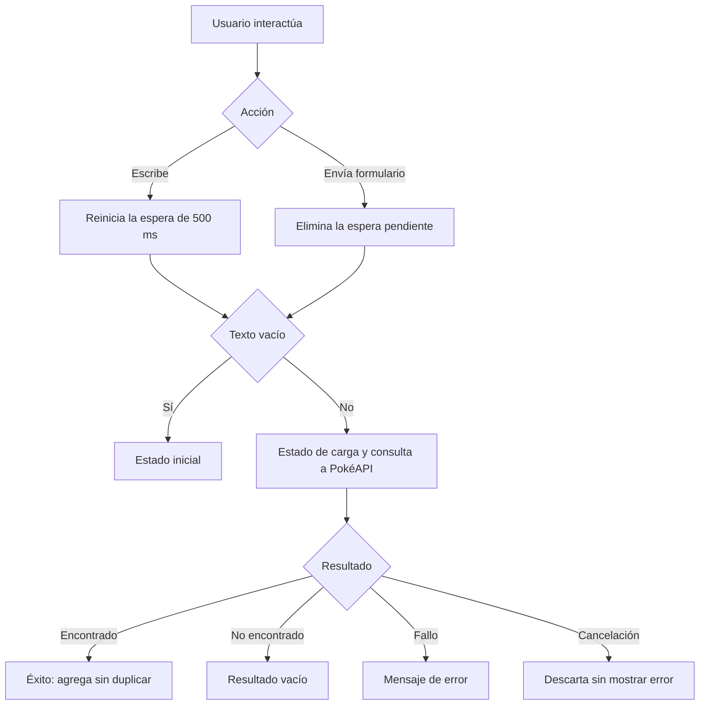

# Pokédex con React y TypeScript

Proyecto académico que migra una Pokédex de JavaScript a React con TypeScript. Permite buscar Pokémon por nombre o número mediante PokéAPI y mostrar su imagen, peso y altura en una colección sin duplicados.

## Tecnologías

- React y TypeScript.
- Vite.
- CSS Grid.
- PokéAPI.
- pnpm.

## Instalación y ejecución

Necesitas Node.js compatible con Vite, pnpm y conexión a Internet.

1. Descarga o clona el proyecto.
2. Abre una terminal dentro de la carpeta del proyecto.
3. Instala las dependencias:

   ```bash
   pnpm install
   ```

4. Inicia el servidor de desarrollo:

   ```bash
   pnpm run dev
   ```

5. Abre la dirección indicada en la terminal, normalmente `http://localhost:5173`.

Para detener el servidor, presiona `Ctrl + C`.

### Compilación de producción

Comprueba los tipos y genera la aplicación:

```bash
pnpm run build
```

Previsualiza la compilación localmente:

```bash
pnpm run preview
```

## Funcionamiento

- Busca por nombre, como `ditto`, o por número, como `132`.
- La búsqueda automática comienza después de 500 ms sin escribir.
- Enter o el botón **Buscar** ejecutan la búsqueda inmediatamente.
- Las solicitudes anteriores se cancelan cuando dejan de ser relevantes.
- Los resultados se agregan a la colección sin duplicarse.
- Se muestran los estados inicial, carga, éxito, resultado vacío y error.
- Las búsquedas fallidas conservan los Pokémon encontrados anteriormente.

La colección se guarda en memoria y se reinicia al recargar la página.

## Organización

| Elemento | Responsabilidad |
| --- | --- |
| `App.tsx` | Coordina estados, eventos, temporizadores y solicitudes. |
| `SearchForm` | Presenta el formulario controlado. |
| `RequestStatus` | Muestra el estado de la búsqueda. |
| `PokemonList` | Renderiza la colección con `map`. |
| `PokemonCard` | Presenta los datos de un Pokémon. |
| `pokemonService.ts` | Consulta PokéAPI y transforma su respuesta. |
| Tipos de TypeScript | Describen datos, propiedades y estados de solicitud. |

## Flujo de búsqueda



Cambiar el texto o iniciar otra búsqueda cancela la solicitud anterior. Al desmontar el componente, se limpian el temporizador y la solicitud activa.

## Conceptos aprendidos

| Concepto | Aplicación en el proyecto |
| --- | --- |
| Props | Transmiten datos y funciones entre componentes. |
| `useState` | Conserva el texto, la colección y el estado de solicitud. |
| Formulario controlado | `value` refleja el estado y `onChange` lo actualiza. |
| Renderizado declarativo | JSX describe la interfaz según los datos, sin manipular manualmente el DOM. |
| `map`, `key` y `some` | Generan tarjetas, mantienen su identidad y detectan duplicados, respectivamente. |
| Unión discriminada | `RequestState` define los estados posibles y los datos asociados a cada uno. |
| Estrechamiento de tipos | Comprobar `null` y terminar con `return` permite utilizar el resultado como `Pokemon`. |
| Debounce | Reduce solicitudes al esperar una pausa al escribir. |
| `AbortController` | Cancela solicitudes iniciadas mediante una señal nueva por solicitud. |
| `useRef` | Conserva temporizadores y controladores sin provocar renderizados. |
| `useEffect` | Registra la limpieza de recursos al desmontar el componente. |
| `async/await` | Permite esperar respuestas asíncronas y manejarlas con `try/catch/finally`. |

Los tipos de TypeScript comprueban el código durante el desarrollo; no validan automáticamente las respuestas externas.

La separación de responsabilidades permite que el servicio adapte los datos de PokéAPI y que los componentes se concentren en presentarlos.

## Accesibilidad

El formulario utiliza una etiqueta asociada al campo, admite navegación con teclado y envío con Enter. Los mensajes usan `role="status"` para comunicar cambios a los lectores de pantalla.